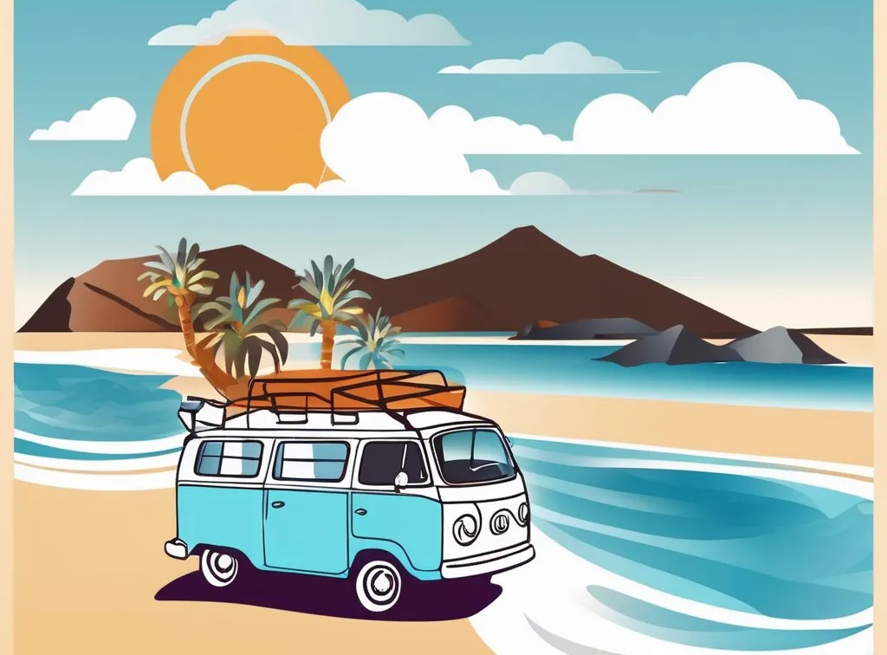

# Header Design Documentation

## Executive Summary

This document outlines the design, implementation, and maintenance guidelines for the modern, responsive header component of **This is Fuerteventura**. The header serves as the primary navigation hub and brand identity anchor, featuring a minimalista yet impactful design that reflects the island's natural beauty (ocean, sand, sky).

---

## 1. Design Philosophy

### 1.1 Core Principles

1. **Minimalismo Inteligente**: Clean lines, plenty of whitespace, and a focused visual hierarchy that prioritizes user needs.
2. **Coherencia Visual**: Colors and typography align with Fuerteventura's identity:
   - **Primary**: Turquesa (#2ec4b6) - ocean and crystalline waters
   - **Secondary**: Arena Dorada (#ffd97d) - sandy beaches
   - **Accent**: Cielo Profundo (#0f4c81) - sky and depth

3. **Responsive-First**: Seamless experience from mobile (320px) to desktop (1920px+).
4. **Accesibilidad**: WCAG 2.1 AA compliance with proper contrast ratios, keyboard navigation, and ARIA labels.
5. **Rendimiento**: No heavy frameworks, CSS-first with optional GSAP enhancements for smooth animations.

### 1.2 Inspiration & Context

- **Natural Elements**: The header evokes the horizon (sticky top), gradient backgrounds suggest the meeting of sea and sky.
- **Contemporary UX**: Borrowing from modern design systems (Apple, Google, Airbnb) while maintaining originality.
- **Island Identity**: Subtle sand texture, ocean blue, and warm tones create an immediate sense of place.

---

## 2. Layout Structure

### 2.1 Component Hierarchy

```
<header> (sticky, z-index: 1020)
├── .header-container (flex, max-width: 1400px)
│   ├── .header-logo (logo + brand text)
│   ├── .header-nav (desktop menu, flex)
│   ├── .header-search (search bar + icon)
│   ├── .header-social (social icons)
│   ├── .header-cta (call-to-action button)
│   ├── .header-hamburger (mobile menu toggle)
│   └── .header-nav-mobile (hidden on desktop, slides down on mobile)
```

### 2.2 Breakpoints

| Breakpoint | Device            | Changes |
|------------|-------------------|---------|
| 768px      | Tablet/Mobile     | Nav hidden, hamburger shown, search compacted |
| 480px      | Small Mobile      | Logo shrinks, social hidden, CTA text hidden |

### 2.3 Desktop Layout (1200px+)

```
[Logo] [Nav Menu] [Search] [Social Icons] [CTA Button]
←────────────────────────────────────────────────→
          flex: 1 (nav expands)
```

**Spacing**: 2rem gaps, 1.5rem padding (sides), 1rem padding (top/bottom).

### 2.4 Mobile Layout (< 768px)

```
[Logo] [Search] [Hamburger]
←──────────────────────→
     flex: 1
```

**Spacing**: Compressed (1rem padding), hamburger toggles slide-down menu below header.

---

## 3. Visual Design

### 3.1 Color System

| Token                | Color      | Usage                           | Contrast Ratio |
|----------------------|------------|---------------------------------|-----------------|
| `--color-mar`        | #2ec4b6    | Primary CTA, hover states       | 4.5:1 (WCAG AA) |
| `--color-arena`      | #ffd97d    | Accent, secondary elements      | 4.8:1           |
| `--color-volcan`     | #22223b    | Background (dark mode)          | 15:1            |
| `--text-color`       | #333333    | Body text (light mode)          | 15:1            |
| `--text-white`       | #ffffff    | Text on dark backgrounds        | 15:1            |

### 3.2 Typography

| Element      | Font Family      | Size    | Weight | Line Height | Letter Spacing |
|--------------|------------------|---------|--------|-------------|-----------------|
| Logo Title   | Yeseva One       | 1.1rem  | 700    | 1.2         | -0.5px         |
| Logo Tagline | Nunito Sans      | 0.7rem  | 500    | 1            | normal         |
| Nav Links    | Nunito Sans      | 0.95rem | 500    | 1.4         | normal         |
| CTA Button   | Nunito Sans      | 0.95rem | 600    | 1            | normal         |

**Rationale**: Yeseva One provides distinctive, artistic branding; Nunito Sans ensures readability and modern aesthetic.

### 3.3 Spacing & Sizing

```css
--spacing-sm: 0.5rem;   /* gaps between small elements */
--spacing-md: 1rem;     /* default padding */
--spacing-lg: 1.5rem;   /* container padding (horizontal) */
--spacing-xl: 2rem;     /* large gaps (nav items) */
```

### 3.4 Border Radius & Shadows

- **Border Radius**: `--border-radius-md: 8px` (icons, search, buttons)
- **Shadow (normal)**: `var(--shadow-sm)`: subtle (0 1px 2px rgba(0,0,0,0.05))
- **Shadow (hover)**: `var(--shadow-lg)`: pronounced (0 10px 15px rgba(0,0,0,0.15))

---

## 4. Component Specifications

### 4.1 Logo Component

**Purpose**: Brand identity anchor.

**Visual States**:
- **Default**: 50px × 50px, rounded corners, clean brand text below.
- **Hover**: Image scales 1.05, rotates -2deg (playful, welcoming).

**Accessibility**:
- Alt text: "This is Fuerteventura Logo"
- Logo is a link to homepage (href="/")

**Code**:
```html
<a href="/" class="header-logo" aria-label="This is Fuerteventura home">
  
  <div class="header-logo-text">
    <h1>This is Fuerteventura</h1>
    <span class="tagline">Guía Turística 2025</span>
  </div>
</a>
```

### 4.2 Navigation Menu

**Purpose**: Primary site navigation.

**Desktop Behavior**:
- Horizontal flex layout, gap 2rem.
- Link underline animates on hover (gradient effect).
- Active page highlighted with turquesa color.

**Mobile Behavior**:
- Hidden on small screens.
- Replaced by hamburger-triggered slide-down menu.
- Each item has left indent on hover (visual feedback).

**Accessibility**:
- `aria-label="Navegación principal"` on nav.
- `aria-current="page"` on active link.
- Keyboard navigation: Tab to navigate, Enter to follow link.

**Code**:
```html
<nav aria-label="Navegación principal" class="header-nav">
  <ul>
    <li><a href="index.html" aria-current="page">Inicio</a></li>
    <li><a href="noticias.html">Noticias</a></li>
    <!-- ... more links ... -->
  </ul>
</nav>
```

### 4.3 Search Bar

**Purpose**: Quick search access for content discovery.

**Desktop Behavior**:
- Input width: 200px, searchable on visible.
- Icon button to toggle/submit.

**Mobile Behavior**:
- Input width: 150px (tablet), 120px (mobile).
- Prioritized in flex order (appears before hamburger).

**Accessibility**:
- Keyboard shortcut: Ctrl+K (or Cmd+K on Mac) toggles search.
- Placeholder text guides user intent.
- Focus ring visible for keyboard navigation.

**Code**:
```html
<div class="header-search">
  <input 
    type="search" 
    class="header-search-input" 
    placeholder="Buscar..." 
    aria-label="Buscar contenido"
  >
  <button class="header-search-btn" aria-label="Enviar búsqueda">
    <i class="fas fa-search" aria-hidden="true"></i>
  </button>
</div>
```

### 4.4 Social Icons

**Purpose**: Community engagement, off-site navigation.

**Visual States**:
- Default: Semi-transparent background (rgba turquesa 0.1).
- Hover: Darker background, icon lifts up 3px, rotates 15deg.
- Hidden on mobile (< 480px).

**Platforms**:
- Facebook, Instagram, TikTok, Twitter/X, WhatsApp.

**Accessibility**:
- `aria-label="Visit our [platform] page"`
- Links open in new tab (`target="_blank"`) with `rel="noopener noreferrer"`.

**Code**:
```html
<ul class="header-social">
  <li>
    <a 
      href="https://facebook.com/thisisfuerteventura" 
      aria-label="Visit our Facebook page"
      target="_blank" 
      rel="noopener noreferrer"
    >
      <i class="fab fa-facebook-f" aria-hidden="true"></i>
    </a>
  </li>
  <!-- ... more socials ... -->
</ul>
```

### 4.5 CTA Button ("Explora la Isla")

**Purpose**: Primary call-to-action, guides users to tourism content.

**Visual States**:
- **Default**: Gradient background (turquesa to darker teal), white text, shadow.
- **Hover**: Scale 1.05, shadow intensifies, smooth transform.
- **Active**: Scale back to 1, subtle shadow reduction.
- **Focus**: Visible outline ring (2px turquesa).

**Animations**:
- Subtle pulse effect on load (shadow oscillation, 2s loop).

**Accessibility**:
- `aria-label` or descriptive text inside.
- Keyboard accessible (Tab to focus, Enter to activate).

**Code**:
```html
<a href="/turismo.html" class="header-cta">
  <i class="fas fa-compass" aria-hidden="true"></i>
  Explora la Isla
</a>
```

### 4.6 Mobile Hamburger Menu

**Purpose**: Navigation access on small screens.

**Visual States**:
- **Closed**: 3-line burger icon (☰).
- **Open**: Icon rotates 90deg, menu slides down with 0.4s animation.

**Animations**:
- Menu slides in from top with fade-in + stagger effect on nav items.
- Hamburger icon pulses when clicked (GSAP elastic).

**Accessibility**:
- `aria-controls="site-nav"` and `aria-expanded="false/true"`.
- Keyboard: ESC closes menu, focus management retained.

**Code**:
```html
<button 
  class="header-hamburger" 
  aria-label="Abrir menú" 
  aria-controls="site-nav" 
  aria-expanded="false"
>
  <i class="fas fa-bars" aria-hidden="true"></i>
</button>

<ul class="header-nav-mobile">
  <!-- same nav items as desktop -->
</ul>
```

---

## 5. Animations & Interactions

### 5.1 GSAP Integration

All animations use GSAP 3.12+ for smooth, performant transitions. Animations gracefully degrade to CSS-only if GSAP is unavailable.

### 5.2 Key Animations

| Trigger        | Animation                             | Duration | Easing            |
|----------------|---------------------------------------|----------|-------------------|
| Page Load      | Header fade-in + slide down           | 0.6s     | power2.out        |
| Hover (logo)   | Image scale 1.05, rotate -2deg        | 0.3s     | power2.out        |
| Hover (nav)    | Underline animates (width: 0 → 100%)  | 0.3s     | power2.out        |
| Hover (social) | Lift 5px, scale 1.15, rotate 15deg   | 0.3s     | back.out          |
| Hover (CTA)    | Scale 1.05, shadow intensifies        | 0.3s     | back.out          |
| Menu Open      | Height auto, opacity 1, y-stagger    | 0.4s     | power2.out        |
| Menu Close     | Height 0, opacity 0                  | 0.32s    | power2.in         |
| Scroll Detect  | Shadow adds (depth)                  | 0.3s     | power2.out        |

### 5.3 Stagger Patterns

**Nav items on menu open**: 0.08s delay between each item (smooth cascade).
**Logo + nav on page load**: 0.05s stagger, starting at 0.3s delay.

### 5.4 Accessibility: Reduced Motion

CSS respects `prefers-reduced-motion`:
```css
@media (prefers-reduced-motion: reduce) {
  header * {
    animation-duration: 0.01ms !important;
    transition-duration: 0.01ms !important;
  }
}
```

---

## 6. Implementation Guide

### 6.1 File Structure

```
project/
├── index.html (HTML markup for header)
├── css/
│   └── header.css (main styles, ~450 lines)
├── js/
│   └── components/
│       └── Header.js (initialization, GSAP integration, ~400 lines)
└── HEADER.md (this documentation)
```

### 6.2 Integration Steps

1. **Add CSS**: Link `css/header.css` in `<head>` (after base styles):
   ```html
   <link rel="stylesheet" href="css/header.css?v=2025120101">
   ```

2. **Add JavaScript**: Include GSAP and Header component before closing `</body>`:
   ```html
   <script src="https://cdnjs.cloudflare.com/ajax/libs/gsap/3.12.2/gsap.min.js"></script>
   <script src="js/components/Header.js" defer></script>
   ```

3. **Update HTML Markup**: Wrap header content in `.header-container` div, use semantic class names (`header-logo`, `header-nav`, etc.).

4. **Test**: Verify keyboard navigation, mobile responsiveness, and animations across browsers.

### 6.3 Browser Support

- **Modern Browsers** (last 2 versions): Full support (animations + GSAP).
- **IE11**: CSS-only fallback (no animations, functional).
- **Mobile**: iOS Safari 12+, Chrome Android latest.

### 6.4 Performance Considerations

- **CSS**: ~8KB minified (no external images in styles).
- **JavaScript**: ~12KB (Header.js), further reduced with GSAP already loaded elsewhere.
- **Runtime**: Smooth 60 FPS on desktop, 30+ FPS on mid-range mobile.

**Optimizations**:
- `will-change: transform` on animated elements (GPU acceleration).
- Passive event listeners on scroll (`{ passive: true }`).
- RequestIdleCallback for deferred animations.

---

## 7. Accessibility Features

### 7.1 WCAG 2.1 AA Compliance

| Criterion | Implementation |
|-----------|-----------------|
| **1.4.3 Contrast (AA)** | All text ≥ 4.5:1 ratio (verified with tools) |
| **2.1.1 Keyboard** | All interactive elements keyboard-accessible (Tab, Enter, ESC) |
| **2.4.1 Skip Link** | Skip-to-main link in body (class `skip-link`) |
| **2.4.7 Focus Visible** | Clear 2px outline on `:focus-visible` |
| **3.2.1 On Focus** | No unexpected context changes on focus |
| **4.1.2 Name, Role, State** | ARIA labels, roles, and states correctly set |

### 7.2 ARIA Implementation

```html
<!-- Navigation container -->
<nav aria-label="Navegación principal" role="navigation">

<!-- Mobile menu button state -->
<button aria-expanded="false" aria-controls="site-nav">

<!-- Active page indicator -->
<a href="current.html" aria-current="page">

<!-- Social link platform identifier -->
<a aria-label="Visit our Facebook page">
```

### 7.3 Keyboard Shortcuts

| Shortcut | Action |
|----------|--------|
| Tab      | Navigate through interactive elements |
| Shift+Tab| Reverse navigation |
| Enter    | Activate focused button/link |
| Space    | Activate focused button |
| ESC      | Close mobile menu (if open) |
| Ctrl+K   | Toggle search (Windows/Linux) |
| Cmd+K    | Toggle search (macOS) |

---

## 8. Customization & Scaling

### 8.1 Design Tokens (CSS Variables)

To customize the header, override these tokens in `:root`:

```css
:root {
  --color-mar: #2ec4b6;            /* primary */
  --color-arena: #ffd97d;          /* secondary */
  --header-bg: #ffffff;            /* background */
  --header-text: #1f2937;          /* text color */
  --transition-base: 0.3s cubic-bezier(0.4, 0, 0.2, 1);
}
```

### 8.2 Responsive Breakpoints

Adjust media query thresholds in `header.css`:

```css
@media (max-width: 768px)   /* tablet */
@media (max-width: 480px)   /* mobile */
```

### 8.3 Adding New Nav Items

Edit `.header-nav` and `.header-nav-mobile` lists (keep aligned):

```html
<li><a href="new-page.html">New Page</a></li>
```

### 8.4 Adding Social Icons

Update `.header-social` list, ensure Icon matches Font Awesome 6:

```html
<li>
  <a href="https://platform.com/user" aria-label="Visit our [Platform] page">
    <i class="fab fa-platform" aria-hidden="true"></i>
  </a>
</li>
```

---

## 9. Maintenance & Versioning

### 9.1 Updates Checklist

When updating the header:
- [ ] Bump CSS version: `?v=YYYYMMDDNN`
- [ ] Test keyboard navigation (Tab, ESC, Ctrl+K)
- [ ] Verify mobile responsiveness (480px, 768px, 1024px)
- [ ] Check contrast ratios (use WebAIM Color Contrast Checker)
- [ ] Test animations (ensure smooth on low-end devices)
- [ ] Update HEADER.md if changes are significant

### 9.2 Known Limitations

1. **GSAP Required**: Some animations don't work without GSAP; CSS fallback is basic.
2. **Browser Support**: Older browsers (< IE11) won't support Grid/Flex; test separately.
3. **Mobile Menu**: Long menu lists may overflow on small screens (consider pagination or nested structure).

### 9.3 Future Enhancements

- [ ] **Dark Mode Toggle**: Add button to switch theme (currently relies on OS preference).
- [ ] **Mega Menu**: Multi-column dropdown for categories (tourism, blog, contact).
- [ ] **Sticky Header Collapse**: Shrink logo/text on scroll for more space.
- [ ] **Animated Logo**: SVG animation (sand flowing, waves moving).
- [ ] **Notification Badge**: Alert count for new content/messages.
- [ ] **Language Switcher**: I18n toggle (EN, ES, DE).

---

## 10. Testing Guide

### 10.1 Manual Testing Checklist

**Desktop (1920px+)**:
- [ ] Logo links to homepage.
- [ ] All nav items clickable and highlight on hover.
- [ ] Search bar expands on click, collapses on blur.
- [ ] Social icons lift/rotate on hover.
- [ ] CTA button pulses and responds to clicks.
- [ ] Header stays sticky on scroll.

**Tablet (768px)**:
- [ ] Nav hidden, hamburger visible.
- [ ] Search compacted (150px).
- [ ] Hamburger opens/closes menu smoothly.
- [ ] Menu items clickable, close menu on selection.

**Mobile (480px)**:
- [ ] Logo shrinks, tagline still readable.
- [ ] Hamburger button visible and functional.
- [ ] Social icons hidden (space optimization).
- [ ] CTA button full-width or icon-only.

**Keyboard Navigation**:
- [ ] Tab through all interactive elements.
- [ ] Focus ring visible on each element.
- [ ] ESC closes mobile menu.
- [ ] Ctrl+K toggles search.

**Screen Reader** (NVDA, JAWS, VoiceOver):
- [ ] Header announced as banner.
- [ ] Nav announced as navigation.
- [ ] Links describe their target (e.g., "Noticias" not "link").
- [ ] Current page highlighted (aria-current="page").
- [ ] Button states announced (aria-expanded).

### 10.2 Automated Testing (Lighthouse/axe)

```bash
# Lighthouse audit (performance, accessibility, best practices)
lighthouse https://thisisfuerteventura.es --chrome-flags="--headless"

# axe accessibility check
npx axe https://thisisfuerteventura.es
```

**Target Scores**:
- Accessibility: ≥ 90
- Performance: ≥ 80
- Best Practices: ≥ 90

### 10.3 Visual Regression Testing

Use Percy or similar to catch unintended style changes:

```bash
npx percy snapshot ./header-test.html
```

---

## 11. Troubleshooting

| Issue | Cause | Solution |
|-------|-------|----------|
| Menu doesn't open | GSAP not loaded | Check script order, load GSAP before Header.js |
| Text overflow on mobile | Content too long | Reduce font sizes at breakpoints or shorten text |
| Header not sticky | CSS not applied | Verify `css/header.css` is linked and not overridden |
| Focus ring not visible | CSS disabled | Re-enable focus styles in browser dev tools |
| Animations choppy | GPU not accelerated | Add `will-change: transform` to animated elements |

---

## 12. Appendix: Color Palette Hex Codes

```
Primary Turquesa:       #2ec4b6
Darker Teal (gradient): #1aa8a0
Arena Dorada:           #ffd97d
Cielo Profundo:         #0f4c81
Texto Oscuro:           #333333
Texto Claro:            #e5e7eb
Fondo Blanco:           #ffffff
Fondo Oscuro:           #0b0f14
```

---

## 13. License & Credits

**Author**: Design & Development Team  
**Created**: November 2025  
**Last Updated**: November 2025  
**Version**: 1.0.0

**Attribution**:
- Icons: Font Awesome 6 (CDN)
- Animations: GSAP 3.12
- Fonts: Google Fonts (Nunito Sans, Yeseva One)

---

## 14. Quick Reference

**Key Files**:
- CSS: `css/header.css`
- JS: `js/components/Header.js`
- HTML: Update header element in relevant `.html` files

**Class Naming Convention**: `.header-[component]` (BEM-inspired for clarity)

**CSS Variables**: Defined in `:root`, overridable per theme or page.

**GSAP Version**: 3.12+ (compatible with latest browsers)

**Mobile First**: Styles defined for mobile, enhanced with media queries for larger screens.

---

For questions or updates, contact the development team or check git history for recent changes.
